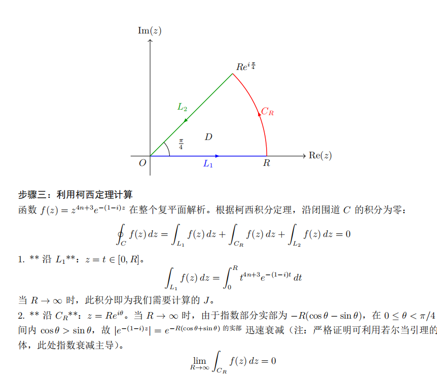
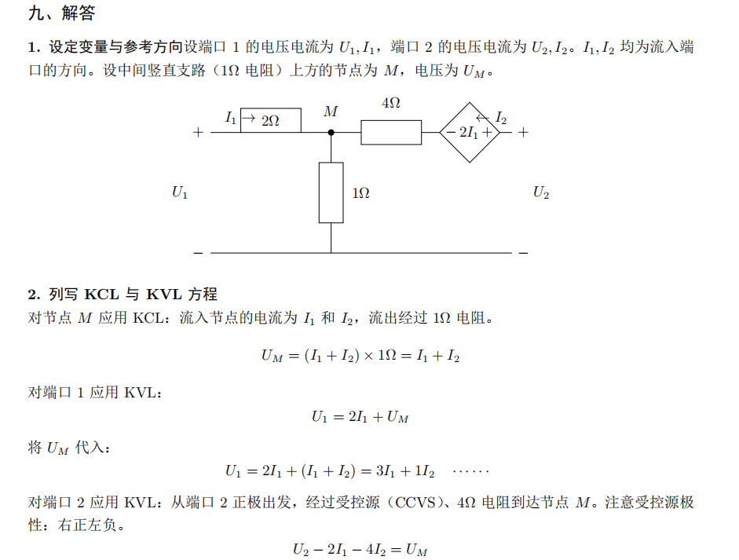

# AstrBot 全学科答疑插件

> ⚠️ **免责声明**：本插件代码主要由 AI 生成，可能存在未知的 bug 或逻辑问题。请在生产环境中使用时保持谨慎，建议先在测试群进行充分测试。

一个功能丰富的 AstrBot 插件，集成 Markdown 渲染、数学，甚至全学科答疑、PDF 生成(支持画图)、DeepThink 多角色迭代求解、知识库检索及对话记忆等能力。

**插件交流群:** 1077289182

## ✨ 功能特性

### 🖼️ Markdown 转图片
- 将包含代码块、表格、数学公式等复杂 Markdown 内容转换为高清图片
- 通过 MathJax 完美渲染 LaTeX 数学公式
- 支持 2 倍缩放高质量渲染
- 支持固定宽度/自适应宽度模式
- Playwright 浏览器自动安装与管理

### 📐 数学答疑提示流
- 自动识别数学题（文字/图片），先给出引导提示，再按需提供完整解答
- AI 根据题目难度自动调整提示条数（简单题 2–3 条，复杂题 4–6 条）
- 支持图片数学题识别
- 自定义数学答疑人格（如"高三数学老师"）
- 可选"路由模型"辅助判断意图

### 📄 `/pdf` — LaTeX PDF 解答
- 使用 LLM 生成 LaTeX 代码，本地 xelatex 编译输出 PDF
- 支持 `<problem>`/`<theorems>`/`<solution>` 结构化输出
- TikZ 绘图支持
- 编译自检 & 自动修复（编译失败时反馈日志让模型重写）
- 解答完整性自检（漏答/未写完自动补全）
- 结尾标记强制约束（`\blacksquare`）
- 编译缓存（避免重复编译）
- 追问上一题 PDF 上下文

### 🧠 `/spdf` — DeepThink 多角色迭代 PDF
- 多个 "solver" 并行生成候选解
- 候选解交叉质询（solver A 挑 solver B 的错）
- Judge 模型评分与验算脚本生成
- Python 沙盒数值/代数自检
- 自一致投票机制
- TikZ 预检与自动修复
- 后处理格式化（英文→中文、标签规范化）
- 支持配置多个模型 provider

> [!WARNING]
> `/spdf` 的 Python 验算功能会在本地执行 LLM 生成的 Python 代码。虽然设有超时限制，但在公共服务器上部署时请注意**代码执行安全风险**。建议在受信任环境中使用，或关闭 `spdf_enable_python_check` 配置。

### 📚 知识库检索增强
- 自动识别"从知识库/题库找类似题"等意图
- 多轮检索 + 宽松 query 候选 + 去重
- 反幻觉策略（强制使用工具原始输出，不允许编造出处）
- 检索不足时可配置补位策略（expand/placeholder/generate）

### 💬 对话记忆
- 本地短期对话历史保存
- 基于 2-gram + IDF 加权 Jaccard 相似检索
- 新鲜度衰减（越新权重越高）
- 自动注入历史对话到上下文，保持连续性

### 🤖 Agent Tool 注册
- 自动注册为 LLM Tools，支持 Agent Function Calling
- `md2img_render_markdown` — 渲染 Markdown 为图片
- `md2img_solve_math_pdf` — 调用 /pdf 逻辑
- `md2img_solve_math_spdf` — 调用 /spdf 逻辑

---

## 📸 效果展示

<table>
  <tr>
    <td align="center"><br/><b>复变函数 · 柯西定理</b></td>
    <td align="center"><br/><b>物理化学 · 蒸气压</b></td>
  </tr>
  <tr>
    <td align="center"><br/><b>电路分析 · KCL/KVL</b></td>
    <td align="center"><br/><b>有机化学 · 实验装置</b></td>
  </tr>
</table>

---

## 📦 安装方法

### 前置要求

- Python 3.8+
- AstrBot 框架
- 本地安装 xelatex（MiKTeX 或 TeX Live）用于 PDF 编译（可选）

### 安装步骤

1. 将插件文件夹放置到 AstrBot 的 `plugins` 目录下
2. 重启 AstrBot 服务
3. 插件会自动安装所需依赖（`mistune` 和 `playwright`）

> [!NOTE]
> 首次安装时会在后台异步安装 Playwright Chromium 浏览器，请在控制台中跟踪进度。

### XeLaTeX 宏包要求（PDF 功能）

如果使用 `/pdf` 或 `/spdf` 功能，需要本地安装 XeLaTeX（MiKTeX 或 TeX Live 均可），并确保以下宏包可用：

| 宏包 | 用途 |
|------|------|
| `ctex` (`ctexart` 文档类) | 中文排版支持 |
| `geometry` | 页面边距设置 |
| `textcomp` | 文本特殊符号（`\textless`、`\textgreater` 等） |
| `amsmath` | 数学公式排版 |
| `amssymb` | 数学符号（含 `\blacksquare`） |
| `amsthm` | 定理环境 |
| `mathtools` | 数学工具扩展 |
| `bm` | 粗体数学符号 |
| `mathrsfs` | 花体字母（`\mathscr`） |
| `cancel` | 删除线标记 |
| `tcolorbox` (含 `most` 选项) | 彩色定理/公式盒子 |
| `enumitem` | 列表样式定制 |
| `tikz` | 绘图 |
| `pgfplots` (≥1.18) | 函数图像绘制 |

**TikZ 库依赖**（自动加载，无需手动安装）：
`arrows.meta`, `calc`, `positioning`, `shapes`, `intersections`, `decorations.pathreplacing`, `decorations.markings`, `patterns`, `scopes`, `backgrounds`

> [!TIP]
> **TeX Live 用户**：运行 `tlmgr install ctex tcolorbox pgfplots mathtools bm mathrsfs cancel enumitem` 安装缺失宏包。
>
> **MiKTeX 用户**：MiKTeX 会在首次编译时自动下载缺失宏包，无需手动安装。

---

## 🚀 使用方法

### 指令列表

| 指令 | 说明 |
|------|------|
| `/pc` | 手动切换为 PC 渲染模式（宽屏） |
| `/pe` | 手动切换为手机渲染模式 |
| `/pdf [题目]` | 生成 LaTeX PDF 标准解答 |
| `/spdf [题目]` | DeepThink 多角色迭代版 PDF 解答 |
| `/memclear` | 清除当前会话的对话记忆 |

### Markdown 渲染

LLM 会自动判断何时使用图片渲染。当需要发送复杂格式内容时，LLM 将 Markdown 包裹在 `<md>` 标签中：

```
<md>
# 标题

- 列表项 1
- 列表项 2

$$\int_0^\infty e^{-x^2} dx = \frac{\sqrt{\pi}}{2}$$
</md>
```

### 数学答疑

直接发送数学题（文字或图片），插件自动识别并进入答疑模式：
- 默认先发送口头提示，引导思路（AI 根据题目难度自动调整提示条数）
- 用户说"完整解答"/"详细过程"等关键词时，切换为完整解答模式
- 使用 `/pdf` 或 `/spdf` 指令可直接获取 PDF 格式解答

### 支持的 Markdown 语法

- ✅ 标题（#、##、###）
- ✅ 有序/无序列表
- ✅ 代码块（语法高亮）
- ✅ 表格
- ✅ LaTeX 数学公式（行内 `$...$` / 独立 `$$...$$`）
- ✅ 粗体、斜体、删除线
- ✅ 引用块
- ✅ 水平分割线

---

## ⚙️ 配置说明

所有配置可在 AstrBot WebUI 中修改。以下是主要配置分类：

### 基础配置

| 配置项 | 默认值 | 说明 |
|--------|--------|------|
| `enable_math_coach` | `true` | 引导式答疑提示流开关 |
| `treat_image_as_math` | `true` | 图片默认按数学题处理 |
| `math_persona` | `"你是一个耐心的数学助教..."` | 数学答疑人格 |

### PDF 配置

| 配置项 | 默认值 | 说明 |
|--------|--------|------|
| `enable_pdf_output` | `true` | `/pdf` 指令开关 |
| `pdf_provider_id` | `""` | PDF 使用的模型（留空=默认） |
| `pdf_enable_compile_guard` | `false` | LaTeX 编译自检与自动修复 |
| `pdf_enable_completeness_guard` | `false` | 解答完整性自检 |

### SPDF DeepThink 配置

| 配置项 | 默认值 | 说明 |
|--------|--------|------|
| `enable_spdf_output` | `true` | `/spdf` 指令开关 |
| `spdf_num_solvers` | `3` | 候选解数量 |
| `spdf_iter_rounds` | `2` | 迭代轮数 |
| `spdf_enable_cross_exam` | `true` | 交叉质询 |
| `spdf_enable_python_check` | `true` | Python 验算 |

### 知识库 & 记忆配置

| 配置项 | 默认值 | 说明 |
|--------|--------|------|
| `force_full_on_kb_query` | `true` | 知识库查询时直接完整回答 |
| `enable_chat_memory` | `true` | 对话记忆开关 |
| `chat_memory_max_turns` | `120` | 最大保存问答对数 |

> 完整配置项请参考 `_conf_schema.json`。

---

## 🔧 技术实现

### 渲染流程

1. **Markdown 解析**：使用 `mistune` 转换为 HTML
2. **数学公式处理**：MathJax 渲染 LaTeX
3. **浏览器渲染**：Playwright Chromium 截图
4. **图片输出**：PNG 高清图片

### PDF 生成流程

1. **LLM 生成** LaTeX 源码（`<problem>`/`<theorems>`/`<solution>` 标签）
2. **LaTeX 清理**：自动转义特殊字符、修复 Markdown 残留
3. **本地编译**：xelatex 编译为 PDF
4. **自检修复**（可选）：编译失败时反馈日志让模型重写

### SPDF DeepThink 流程

1. **多 solver 并行**生成候选解
2. **交叉质询**：每个 solver 审查其他候选
3. **Judge 评分**：综合质询意见打分
4. **Python 验算**：本地沙盒执行验算脚本
5. **自一致投票**：多 solver 投票选出最佳
6. **后处理格式化**：翻译为中文 + 标签规范化
7. **xelatex 编译** 输出 PDF

---

## 📋 依赖

- `mistune` — Markdown 解析器
- `playwright` — 浏览器自动化（用于渲染）
- `xelatex`（系统级，可选）— LaTeX 编译（MiKTeX / TeX Live）

## 📄 许可证

[CC BY-NC-SA 4.0](LICENSE)
