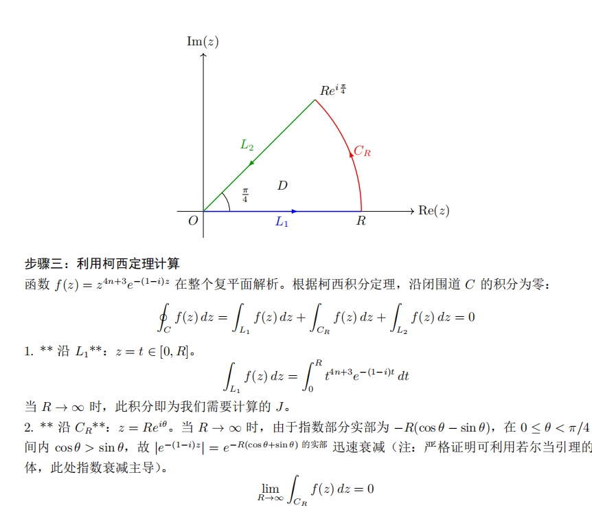
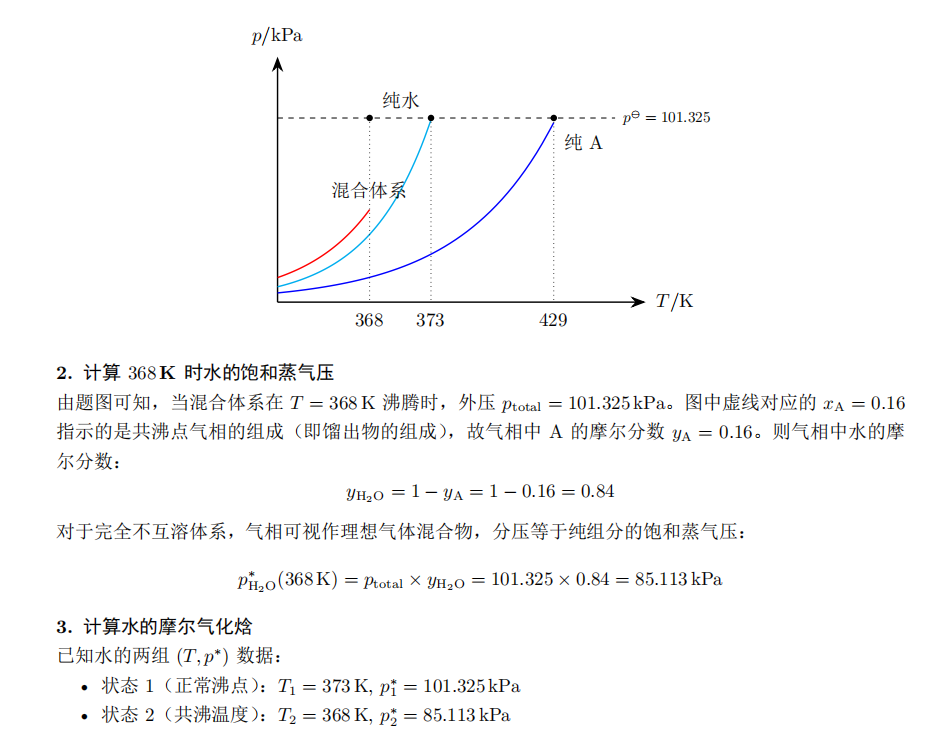
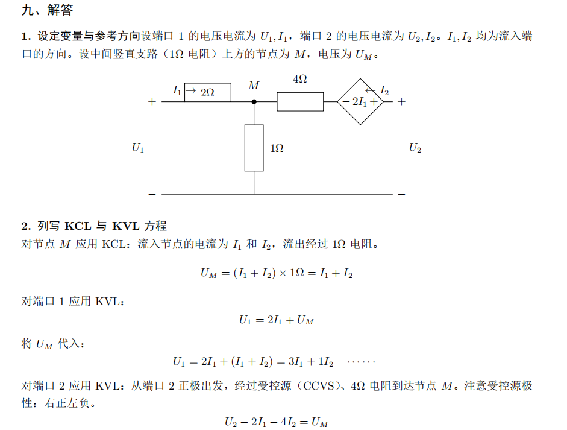
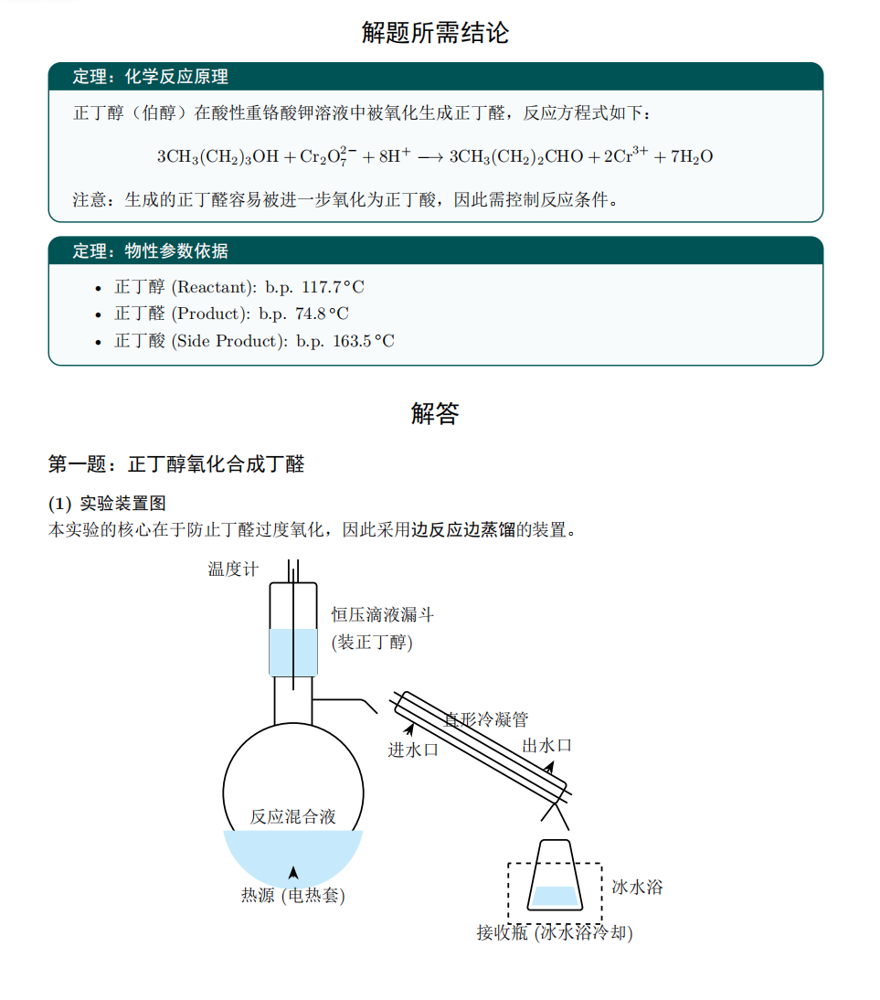

# AstrBot 全学科答疑插件

> 当前版本：`v1.11.0`
> 开源协议：`MIT License`

一个面向 AstrBot 的数学与全学科答疑插件，主要提供 Markdown 转图片、数学图文讲义、LaTeX PDF 解答、本地知识库检索和短期对话记忆等能力。

> 外部联网搜索交给 AstrBot 自身的 Agent / 工具系统处理。本插件不再内置联网搜索关键词配置，只保留数学答疑、本地知识库、渲染和 PDF 生成相关能力。


## 功能特性

### Markdown 转图片

- 将包含代码块、表格、数学公式的 Markdown 渲染为图片
- 支持 MathJax 渲染 LaTeX 数学公式
- 支持 PC 宽屏模式和移动端阅读模式
- 使用 Playwright Chromium 截图输出
- PagedJS 分页等待、Playwright 超时、渲染并发均可在 WebUI 中调整

### 数学图文答疑

- 自动识别文字题和图片题
- 默认输出适合群聊阅读的完整图文讲义
- 支持自定义数学答疑人格
- 可选路由模型辅助判断题目意图
- 可选内联 SVG 示意图，用于几何、函数图像、积分区域等题目

### `/pdf` LaTeX PDF 解答

- 使用 LLM 生成 LaTeX 片段，本地 xelatex 编译为 PDF
- 支持 `<problem>` / `<theorems>` / `<solution>` 三段结构
- 支持 TikZ 绘图
- 支持主模型和候补模型按顺序回退
- 可选编译自检、自动修复和完整性检查
- 支持引用上一份 PDF 上下文继续追问

### 本地知识库检索

- 识别“从知识库/题库找类似题”等意图
- 调用 AstrBot 本地知识库工具检索
- 结果要求包含来源信息，避免把生成内容冒充知识库命中
- 命中不足时可选择扩大检索、占位说明或生成外部补位题

### 对话记忆

- 保存当前会话的短期问答历史
- 基于 2-gram + IDF 加权 Jaccard 做相似检索
- 按新鲜度衰减权重
- 图片题默认不注入旧问答，避免串题

### Agent Tool 注册

插件会尝试注册为 AstrBot LLM Tools：

- `md2img_render_markdown`：渲染 Markdown 为图片
- `md2img_solve_math_pdf`：调用 `/pdf` 逻辑生成 PDF
- `md2img_solve_math_spdf`：调用 `/spdf` 扩展逻辑生成 PDF

## 扩展功能：`/spdf` DeepThink PDF

`/spdf` 是扩展功能，不是日常使用的必需路径。它适合更复杂、需要多模型交叉检查的题目，但会消耗更多模型调用，也更慢。

流程大致为：

1. 多个 Solver 模型并行生成候选解
2. 候选解之间交叉质询
3. Judge 模型评分并生成验算点
4. 可选 Python 验算
5. 自一致投票
6. 后处理格式化为标准 LaTeX 三段结构
7. xelatex 编译输出 PDF

> 安全提示：`/spdf` 的 Python 验算会在本地执行 LLM 生成的短 Python 脚本。插件做了长度限制、黑名单、隔离模式和超时限制，但这不是强安全沙箱。公共服务器或不可信群聊中建议关闭 `spdf_enable_python_check`。

## 效果展示

<table>
  <tr>
    <td align="center"><br/><b>复变函数 · 柯西定理</b></td>
    <td align="center"><br/><b>物理化学 · 蒸气压</b></td>
  </tr>
  <tr>
    <td align="center"><br/><b>电路分析 · KCL/KVL</b></td>
    <td align="center"><br/><b>有机化学 · 实验装置</b></td>
  </tr>
</table>

## 安装方法

### 方式一：AstrBot 插件市场

如果插件已上架 AstrBot 插件市场，可在 AstrBot WebUI 的插件市场中搜索并安装：

```text
astrbot_plugin_mathsolve
```

安装后重启 AstrBot，并在插件配置页检查模型、渲染和 PDF 相关设置。

### 方式二：GitHub 手动安装

进入 AstrBot 的插件目录，克隆本仓库：

```bash
git clone https://github.com/blueraina/astrbot_plugin_mathsolve.git
```

然后在 AstrBot 使用的同一个 Python 环境中安装依赖：

```bash
cd astrbot_plugin_mathsolve
pip install -r requirements.txt
python -m playwright install chromium
```

最后重启 AstrBot。

### 前置要求

- Python 3.8+
- AstrBot 框架
- `mistune` 和 `playwright` Python 包
- Chromium 浏览器运行时，用于 Markdown 转图片
- 仓库已内置 MathJax 2.7.7 和 PagedJS 0.4.3 前端静态文件，用于公式渲染和 `/pc` 分页
- 使用 `/pdf` 或 `/spdf` 时，需要本地可用的 xelatex

插件启动时会在后台尝试运行：

```bash
python -m playwright install chromium
```

如果服务器网络环境导致自动安装失败，可手动执行同一命令。

仓库默认包含 `vendor/md2img/`，用户下载插件时会同时获得本地 MathJax/PagedJS 文件。正常情况下 Markdown 转图片不会依赖 CDN；只有本地文件缺失或被删掉时，插件才会回退到 CDN。

## XeLaTeX 宏包要求

如果使用 `/pdf` 或 `/spdf`，需要本地安装 MiKTeX 或 TeX Live，并确保以下宏包可用：

| 宏包 | 用途 |
| --- | --- |
| `ctex` (`ctexart` 文档类) | 中文排版支持 |
| `geometry` | 页面边距设置 |
| `textcomp` | 文本特殊符号 |
| `amsmath` | 数学公式排版 |
| `amssymb` | 数学符号，含 `\blacksquare` |
| `amsthm` | 定理环境 |
| `mathtools` | 数学工具扩展 |
| `bm` | 粗体数学符号 |
| `mathrsfs` | 花体字母 |
| `cancel` | 删除线标记 |
| `tcolorbox` | 彩色定理/公式盒子 |
| `enumitem` | 列表样式定制 |
| `tikz` | 绘图 |
| `pgfplots` | 函数图像绘制 |

TikZ 库会在模板中自动加载：

```text
arrows.meta, calc, positioning, shapes, intersections,
decorations.pathreplacing, decorations.markings, patterns,
scopes, backgrounds
```

TeX Live 用户可尝试：

```bash
tlmgr install ctex tcolorbox pgfplots mathtools bm mathrsfs cancel enumitem
```

MiKTeX 通常会在首次编译时自动下载缺失宏包。

## 使用方法

### 指令列表

| 指令 | 说明 |
| --- | --- |
| `/pc` | 切换为 PC 渲染模式，适合宽屏长图 |
| `/pe` | 切换为移动端渲染模式 |
| `/pdf [题目]` | 生成 LaTeX PDF 标准解答 |
| `/spdf [题目]` | 扩展功能：DeepThink 多角色 PDF 解答 |
| `/memclear` | 清除当前会话的对话记忆 |

### Markdown 渲染

当需要发送复杂格式内容时，让模型将 Markdown 包裹在 `<md>` 标签中：

```markdown
<md>
# 标题

- 列表项 1
- 列表项 2

$$
\int_0^\infty e^{-x^2} dx = \frac{\sqrt{\pi}}{2}
$$
</md>
```

### 数学答疑

直接发送数学题文字或图片，插件会尝试识别并进入图文答疑流程：

- 默认输出完整图文讲义
- 如果用户明确说“提示”“思路”“先提示”，插件不接管该题，交给普通对话模型回答
- 完整解答会使用 `<md>` 触发 Markdown 转图片
- 开启 `full_solution_prefer_svg_diagram` 后，几何/函数/积分区域/空间立体题会更倾向于生成内联 SVG 示意图
- 使用 `/pdf` 可直接获取 PDF 格式解答

## 配置说明

所有配置可在 AstrBot WebUI 中修改。当前 `_conf_schema.json` 按 7 个分组组织，常用项在前，高级项在后；所有模型 provider 选择项均使用 AstrBot 的下拉选择器。

### 基础答疑

| 配置项 | 默认值 | 说明 |
| --- | --- | --- |
| `enable_math_coach` | `true` | 数学图文答疑总开关 |
| `treat_image_as_math` | `true` | 图片消息默认按数学题处理 |
| `full_solution_prefer_svg_diagram` | `true` | 完整解答中鼓励模型生成内联 SVG 示意图 |
| `math_persona` | 见配置页 | 数学答疑人格 |
| `use_router_model` | `false` | 启用路由模型辅助判断意图 |
| `router_provider_id` | `""` | 路由模型，下拉选择 |

### Markdown 转图片 / 渲染

| 配置项 | 默认值 | 说明 |
| --- | --- | --- |
| `reuse_playwright_browser` | `true` | 复用 Playwright 浏览器 |
| `auto_install_playwright_chromium` | `true` | 启动时后台安装/确认 Chromium |
| `playwright_install_timeout_sec` | `600` | Chromium 安装超时 |
| `render_concurrency` | `2` | Markdown 转图片并发上限 |
| `playwright_render_timeout_sec` | `60` | Playwright 页面加载、截图等操作超时 |
| `playwright_wait_until` | `networkidle` | 页面加载等待策略 |
| `pagedjs_wait_timeout_sec` | `30` | PC 分页等待 PagedJS 超时 |

### PDF 生成

| 配置项 | 默认值 | 说明 |
| --- | --- | --- |
| `enable_pdf_output` | `true` | `/pdf` 指令开关 |
| `pdf_provider_id` | `""` | `/pdf` 主模型，下拉选择；留空=当前会话模型 |
| `pdf_provider_timeout_sec` | `180` | 主模型调用超时 |
| `pdf_enable_provider_preflight` | `true` | 生成前做模型连通性预检 |
| `pdf_fallback_provider_id_1` ~ `pdf_fallback_provider_id_5` | `""` | 候补模型，下拉选择，按顺序回退 |
| `pdf_fallback_provider_timeout_sec_1` ~ `pdf_fallback_provider_timeout_sec_5` | `180` | 每个候补模型各自的超时时间 |
| `pdf_fallback_on_compile_error` | `true` | LaTeX 编译失败时继续尝试候补模型 |
| `pdf_snapshot_images_before_generation` | `true` | 生成前快照远程图片 |

### PDF 自检 / 修复

| 配置项 | 默认值 | 说明 |
| --- | --- | --- |
| `spdf_disable_tools_during_generation` | `true` | PDF/SPDF 生成阶段禁用 tools/function-calling |
| `pdf_enable_compile_guard` | `false` | 启用 LaTeX 编译自检与自动修复 |
| `pdf_guard_provider_id` | `""` | PDF 编译判错模型，下拉选择 |
| `pdf_enable_completeness_guard` | `false` | 启用解答完整性自检 |
| `pdf_completeness_guard_provider_id` | `""` | PDF 完整性判定模型，下拉选择 |

### SPDF DeepThink

`/spdf` 是扩展功能。如果不使用它，本组配置可保持默认。

| 配置项 | 默认值 | 说明 |
| --- | --- | --- |
| `enable_spdf_output` | `true` | `/spdf` 指令开关 |
| `spdf_provider_id` | `""` | SPDF 基础模型，下拉选择 |
| `spdf_solver_provider_id_1` ~ `spdf_solver_provider_id_4` | `""` | Solver 模型槽位，下拉选择 |
| `spdf_judge_provider_id` | `""` | Judge 模型，下拉选择 |
| `spdf_cross_exam_provider_id` | `""` | 交叉质询模型，下拉选择 |
| `spdf_num_solvers` | `3` | 候选解数量 |
| `spdf_iter_rounds` | `2` | 迭代轮数 |
| `spdf_enable_python_check` | `true` | 启用本地 Python 验算 |

### 知识库与对话记忆

| 配置项 | 默认值 | 说明 |
| --- | --- | --- |
| `force_full_on_kb_query` | `true` | 知识库查询时输出完整图文回答 |
| `kb_default_pick_count` | `2` | 默认返回知识库结果数量 |
| `kb_insufficient_strategy` | `expand` | 知识库命中不足时的补位策略 |
| `enable_chat_memory` | `true` | 启用短期对话记忆 |
| `chat_memory_max_turns` | `120` | 每个会话最多保存问答对 |

> 本地知识库检索不是外部联网搜索。需要联网搜索时，请使用 AstrBot 自身 Agent 的联网/搜索工具能力。

### 运行时高级项

| 配置项 | 默认值 | 说明 |
| --- | --- | --- |
| `session_ttl_sec` | `86400` | 会话状态保留时间 |
| `last_image_valid_sec` | `3600` | 上一张图片可复用有效期 |
| `pdf_reuse_last_image_with_text_mode` | `smart` | 文字追问时是否复用上一张图片 |
| `local_xelatex_timeout_sec` | `60` | 本地 xelatex 编译超时 |
| `tex_compile_concurrency` | `2` | xelatex 编译并发上限 |
| `texlive_cache_enabled` | `true` | 启用 TeX 编译缓存 |

完整配置项请参考 `_conf_schema.json`。

## 安全与隐私

- 本插件会处理用户发来的题目文本和图片，并把它们发送给 AstrBot 当前配置的模型 provider。
- `/pdf` 和 `/spdf` 会把图片 URL 下载为本地快照，用于避免临时链接过期。
- `/pdf` 和 `/spdf` 会编译 LLM 生成的 LaTeX。插件会做清理和超时控制，但仍建议先在测试环境验证。
- `/spdf` 的 Python 验算会执行 LLM 生成的短脚本，不是强安全沙箱；公共服务器建议关闭 `spdf_enable_python_check`。
- 本地对话记忆保存在运行中的会话状态中，可用 `/memclear` 清除当前会话记忆。
- 插件不内置外部联网搜索；相关能力由 AstrBot 自身 Agent / 工具系统负责。

## 常见问题

### Chromium 安装失败

手动执行：

```bash
python -m playwright install chromium
```

如果服务器无法访问下载源，需要先配置可用网络或代理。

### Markdown 转图片超时

优先在 WebUI 的“Markdown 转图片 / 渲染”分组中调整：

- `playwright_render_timeout_sec`
- `playwright_wait_until`
- `render_concurrency`

长图、复杂 SVG 或大量公式会显著增加渲染时间。

### `/pc` PagedJS 分页超时

`/pc` 会等待 PagedJS 生成分页节点。长公式或复杂排版可能导致等待超时，可尝试：

- 调大 `pagedjs_wait_timeout_sec`
- 改用 `/pe` 移动端模式
- 减少单次输出内容长度

如果日志出现 `local MathJax not found` 或 `local PagedJS not found`，说明当前安装目录缺少 `vendor/md2img/`，建议重新拉取最新仓库或重新安装插件。

### `/pdf` 或 `/spdf` 提示找不到 xelatex

确认 MiKTeX 或 TeX Live 已安装，并且 `xelatex` 在系统 PATH 中：

```bash
xelatex --version
```

### LaTeX 宏包缺失

TeX Live 可用 `tlmgr install ...` 安装缺失宏包。MiKTeX 通常会在首次编译时自动下载。

### 模型鉴权失败

检查 AstrBot 对应 provider 是否已配置 Key / Token。`/pdf` 和 `/spdf` 中单独选择的候补模型、Judge 模型、Solver 模型也都需要可用鉴权。

### tool_calls / function_call 导致生成失败

保持 `spdf_disable_tools_during_generation=true`。该配置会在 PDF/SPDF 内部生成时尽量禁用 tools/function-calling，避免模型返回工具调用格式破坏 LaTeX 输出。

## 技术实现

### Markdown 渲染流程

1. 使用 `mistune` 将 Markdown 转为 HTML
2. 使用 MathJax 渲染 LaTeX
3. 使用 Playwright Chromium 打开页面并截图
4. PC 模式可通过 PagedJS 分页，失败时会回退为普通长图截图

### PDF 生成流程

1. LLM 生成 LaTeX 片段
2. 插件解析 `<problem>` / `<theorems>` / `<solution>`
3. 清理不安全或不兼容的 LaTeX 片段
4. 本地 xelatex 编译为 PDF
5. 可选自检、修复、完整性补全

## 依赖

- `mistune`：Markdown 解析
- `playwright`：浏览器渲染和截图
- `xelatex`：系统级依赖，用于 PDF 编译
- `vendor/md2img/mathjax-2.7.7`：MathJax 2.7.7，Apache-2.0
- `vendor/md2img/pagedjs/paged.polyfill.js`：PagedJS 0.4.3，MIT

## 许可证

[MIT License](LICENSE)
